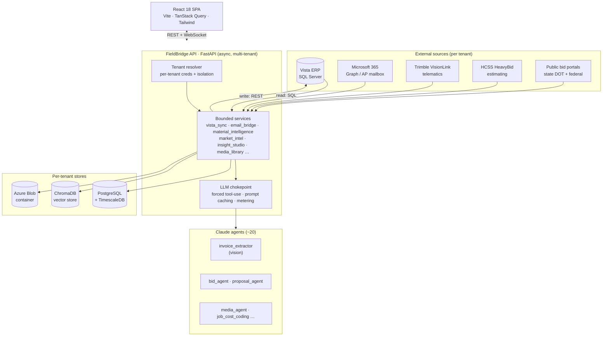

<p align="center">
  
</p>

<h1 align="center">FieldBridge</h1>

<p align="center">
  <b>A multi-tenant SaaS platform that wraps Trimble Viewpoint Vista ERP with AI for heavy-civil contractors.</b>
</p>

<p align="center">
  
  
  
  
  
  
</p>

<p align="center">
  <i>This is a public showcase of a private production codebase. Source is proprietary; the highlights, architecture, and code excerpts here are sanitized for public view - no credentials, customer data, or proprietary ERP schema are included.</i>
</p>

---

## What it is

Heavy-civil contractors run their entire business on **Trimble Viewpoint Vista** - an enterprise ERP that holds job costs, payroll, AP, equipment, and work orders behind a SQL Server database that's powerful but unfriendly to the field. FieldBridge is a SaaS layer on top of it: one deployment serves many contractor companies, each connected to **their own** Vista instance, M365 tenant, and cloud storage, with hard data isolation between them.

On top of that integration layer sits a suite of **AI-native** features - document-vision invoice extraction, materials price intelligence, public-bid competitive analytics, an agentic data-analysis studio, predictive maintenance, and a semantic project-memory store - all metered per tenant for cost control.

I designed and built it solo, end-to-end, validated against a **production Vista ERP** with real data - not a toy dataset - on a "make it work for one real operation first, then generalize" path.

> **Note on scope.** FieldBridge is designed ERP-agnostic where it can be - Vista is the first integration, not the only intended one. Vendor-specific schema lives behind a single bounded service so a second ERP is an adapter, not a rewrite.

---

## Screenshots

> Every screenshot runs on a fictional demo tenant ("Summit Civil Constructors") populated with synthetic data - no real customer, vendor, or financial information. **[See all 13 dashboards in the full gallery.](docs/screenshots.md)**

**Executive Dashboard** - cross-module KPI rollup: financial (WIP), operations, bid pipeline, and roster, with a trailing-12-month estimate-vs-actual revenue curve.


**Recommendations** - Claude-generated next-actions aggregated across every module, prioritized P1/P2/P3 with dollar impact, owner, and a recommended step. The same insight engine feeds a recommendation rail on each dashboard.


**Activity Feed** - every Claude agent run and ingest job, severity-ranked, with per-call token counts and cost - the metering layer made visible.


**Fleet P&L** - per-truck haul activity: revenue, A/R exposure, ownership mix, and utilization, rolled up from the equipment-utilization mart.


> More: Equipment, Jobs (WIP), Bids, Cost Coding, Predictive Maintenance, Work Orders, Vendors, Proposals, and Safety - all in the **[full gallery](docs/screenshots.md)**.

---

## Architecture at a glance



**Three layers:**

1. **FastAPI backend** - owns the tenant database (Postgres), proxies/mirrors Vista, and exposes a versioned REST API plus WebSocket transport. All business logic lives here.
2. **Claude agents** - ~20 domain agents that code transactions, parse bids, extract invoices, tag media, and write proposals - invoked from backend services through a single metered LLM entry point.
3. **React frontend** - a thin client: ~28 feature modules over shadcn/ui + Tailwind, with charts (Recharts) and live maps (maplibre).

See [docs/architecture.md](docs/architecture.md) for service boundaries, the read/write split, and the multi-tenancy model.

---

## Engineering highlights

These are the parts I'm most proud of. Each links to a deeper write-up with sanitized code in [docs/code-highlights.md](docs/code-highlights.md).

### 🧾 Document-AI invoice extraction
Vendor billing PDFs land in an AP mailbox and become structured records - a ~40-field header plus typed line items, classified by document type. The pipeline sends each PDF to Claude as a **vision `document` block** rather than parsing text, after a calibration run measured **~89% per-line price capture via vision vs. ~22% via text**. Forced `tool_choice` guarantees schema-valid JSON; a `max_tokens` guard catches truncation; cost runs ~$0.024/PDF across a ~26,000-document corpus.

### 💰 Materials price intelligence
Two purchasing feeds (ERP purchase/AP lines + extracted invoices, ~90k lines) are unified into one price benchmark that surfaces the cheapest vendor per material. The ERP's material code is populated on only **~1.5%** of PO lines, so comparison can't rely on it - instead a **two-pass entity-resolution** design runs a deterministic catalog join first (free, high-confidence), then sends only the *distinct* descriptions to an LLM normalizer that splits each into `base_material`, `size_spec`, `part_number`, and a confidence score. Deduping before inference is the cost lever.

### 🏗️ Bid intelligence (registry-driven scrapers)
Crawls public construction-bid results across multiple state DOT portals + the federal feed, parses award announcements into structured events, and computes competitor price curves. A **plugin registry + abstract `Fetcher`/`PostParser`/`Pipeline` framework** means a new source is a class, not a rewrite; a shared adapter backs portals built on the same procurement engine; rapidfuzz reconciles inconsistent contractor names.

### 🤖 Agentic insight studio
Upload arbitrary spreadsheets/documents and an agent produces a structured analytical report - running a Claude tool-use loop with a **sandboxed `run_python` executor** and an `emit_section` writer, streaming sections as they're produced. Model tiering (strong model for analysis, cheap model for suggestions) controls cost.

### 🔌 ERP integration layer
A single bounded service is the **only** code path to Vista: **all reads via pyodbc SQL, all writes via the Vista REST API**, enforced as an architectural rule with one chokepoint so no other module can open a raw connection. Per-tenant credentials live on the tenant row; an f-string-SQL guard test prevents injection.

### 🏢 Multi-tenant foundation
One deployment, many contractor companies, **isolation by construction**: UUID PKs, a cascading `tenant_id` FK on nearly every table (100+ references across 23 models), tenant-first composite indexes, per-tenant ERP/Azure credentials, per-tenant vector collections and blob containers - with a model-level test that *enforces* tenant scoping. A single deliberate exception (global human identity for cross-GC jobsite check-in) shows the boundary was reasoned about, not blanket-applied.

### 💬 Real-time chat with AI participants
In-app DMs over WebSockets with Redis pub/sub fan-out, read receipts, and AI senders on the same transport. JWT rides the query string (browsers can't set WS headers) with server-side validation; reconnection uses exponential backoff with full jitter capped at 30s; channels are idempotent; it degrades gracefully when Redis is absent.

### 📊 Cost-controlled LLM platform
A single Anthropic entry point wraps the Messages API with forced tool-use and prompt caching; **every** call's token usage - including cache tokens - is metered per tenant and per agent into a `usage_events` table with a cost calculator; models tier across Haiku / Sonnet / Opus by task.

---

## Tech stack

| Layer | Tech |
|---|---|
| **Backend** | Python 3.12, FastAPI, async SQLAlchemy 2.0, Pydantic v2, Alembic |
| **Frontend** | React 18, TypeScript, Vite, React Router v6, TanStack Query, Zustand, Tailwind, shadcn/ui, Recharts, maplibre |
| **Data** | PostgreSQL (+ TimescaleDB hypertables), Redis, ChromaDB (vectors), Azure Blob |
| **AI** | Anthropic Claude (Opus / Sonnet / Haiku), vision document understanding, tool-use, prompt caching |
| **Integrations** | Trimble Viewpoint Vista (SQL + REST), HCSS HeavyBid, Trimble VisionLink, Autodesk Platform Services, Microsoft 365 / Graph |
| **Infra / CI** | Docker Compose, Render (web + Postgres + staggered cron pipelines), Vercel, GitHub Actions (ruff · pytest+coverage · eslint · vitest) |

---

## A look at the code

The codebase is private, but here are a few representative excerpts. Full versions and more in [docs/code-highlights.md](docs/code-highlights.md).

**The single LLM chokepoint - forced tool-use + prompt caching + metering, in one place:**

```python
response = client.messages.create(
    model=model,
    max_tokens=max_output_tokens,
    system=[{
        "type": "text",
        "text": prompt_template,
        "cache_control": {"type": "ephemeral"},   # repeated calls pay ~10x-cheaper cache reads
    }],
    tools=[_recommendation_tool()],
    tool_choice={"type": "tool", "name": "submit_recommendations"},  # schema-valid JSON, guaranteed
    messages=[{"role": "user", "content": user_message}],
)
# ... single tool_use block -> pydantic model_validate -> metered per tenant & per agent
```

**The ERP read/write split - one chokepoint, per-tenant credentials:**

```python
def get_vista_connection_for_tenant(tenant: Tenant):
    """Return a pyodbc connection scoped to THIS tenant's Vista instance.
    Each customer company has its own Vista SQL Server credentials."""
    import pyodbc
    return pyodbc.connect(build_vista_conn_str(tenant), timeout=10)

# Reads go through pyodbc SQL (read-only service account).
# Writes go through the Vista REST API - never SQL. Enforced as an architectural rule.
```

---

## About

I'm **Skyler Seegmiller** - I designed and built FieldBridge end-to-end: multi-tenant backend architecture, the Vista integration layer, ~20 Claude agents and the metered LLM platform, the document-AI pipelines, and the React frontend, plus the CI/CD and deployment.

If you'd like to talk about the work - multi-tenant SaaS, ERP integration, or production LLM systems for vertical industries - reach out on [GitHub](https://github.com/skylerseeg).

---

<p align="center"><sub>FieldBridge is proprietary software. This repository is a portfolio showcase and contains no source code, credentials, or customer data from the production system.</sub></p>
