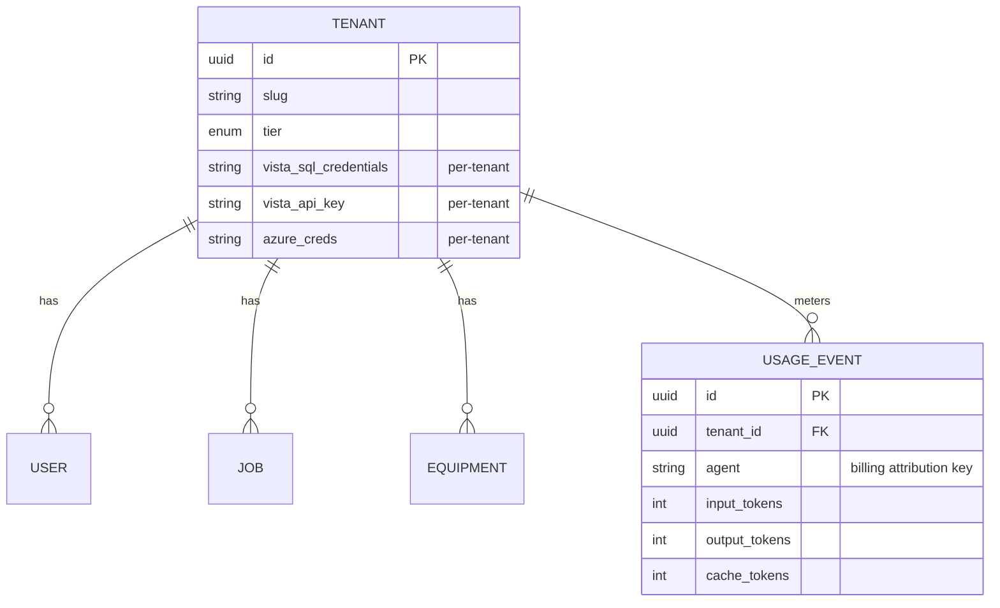
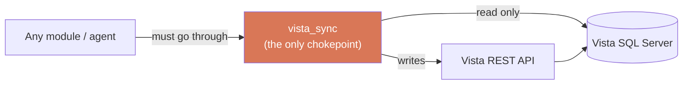

# FieldBridge — Architecture

A deeper look at how FieldBridge is structured. No credentials, customer data, or proprietary ERP schema appear here — relationships and design decisions only.

## The big picture

FieldBridge is a **multi-tenant SaaS wrapper around Trimble Viewpoint Vista ERP** for heavy-civil contractors. Three layers:

1. **FastAPI backend** owns the tenant database (Postgres) and proxies/mirrors Vista data.
2. **Claude agents** do the domain AI work (coding transactions, parsing bids, extracting invoices, writing proposals), invoked from backend services.
3. **React frontend** is a thin client — all business logic is server-side.

## Multi-tenancy model

One row per customer company in `tenants`. Every tenant stores **their own** Vista SQL credentials, Vista REST API key, and M365/Azure creds on the tenant row — per-tenant connections are produced from those, never from global settings.

Isolation is enforced **by construction**, not by convention:

- UUID4 primary keys everywhere (`String(36)`).
- A `tenant_id` foreign key with cascade on nearly every table — 100+ references across 23 model files.
- Tenant-first composite indexes so every query is naturally scoped.
- Per-tenant ChromaDB collections and per-tenant Azure Blob containers.
- A model-level test that **enforces** tenant scoping as an invariant.

One deliberate exception: a single global human identity (for cross-general-contractor jobsite check-in, where one worker should be one identity across companies). The exception is documented precisely because the rule is otherwise absolute.

## The ERP read/write split

Vista data is mission-critical and easy to corrupt, so access is funneled through **one bounded service** (`vista_sync`) that is the only path to the ERP:

- **Reads** → `pyodbc` against SQL Server, using a **read-only** service account.
- **Writes** → the Vista **REST API** (or CSV import). **Never** SQL writes.

This is a hard architectural rule, not a guideline. No other module may open a raw Vista connection. Field naming is normalized at the boundary (PascalCase ERP columns → snake_case), and an f-string-SQL guard test guards against injection.

## Service boundaries

Each backend service is bounded with explicit "may call" rules to keep dependencies acyclic:

| Service | Owns | May call |
|---|---|---|
| `email_bridge` | M365 OAuth, email parse, CSI inference | `vista_sync` (write) |
| `vista_sync` | Vista SQL read + REST write | — |
| `material_intelligence` | Price normalization, cheapest-vendor rollups | `vista_sync` |
| `bid_intelligence` | PDF parse, BOM extraction | `email_bridge`, agents |
| `market_intel` | Public-bid scraping + competitive analytics | — |
| `insight_studio` | Agentic data analysis (sandboxed) | LLM platform |
| `project_memory` | ChromaDB vector store | — |
| `proposal_engine` | Section drafting + assembly | `project_memory`, `media_library` |
| `media_library` | Azure Blob, AI tagging index | `media_agent` |
| `metering` | Per-tenant/per-agent Claude usage events | — |

## The LLM platform

Every Claude call in the system funnels through a single metered entry point so the system prompt, tool schema, caching, error handling, and cost accounting live in exactly one place:

- **Forced tool-use** (`tool_choice`) → schema-valid JSON, never free-form text to parse.
- **Prompt caching** → the system prompt is wrapped in an `ephemeral` cache-control block; repeated calls in the cache window pay ~10× cheaper cache-read prices. Volatile data context is deliberately *not* cached.
- **Model tiering** → Haiku / Sonnet / Opus chosen by task; Opus reserved for the high-leverage "moat" prompts.
- **Metering** → token usage (including cache-read/write tokens) is recorded per tenant and per agent into `usage_events`, with a cost calculator. Metering failures are swallowed — a billing hiccup must never break a user-facing endpoint.
- **Graceful degradation** → if no API key is configured, callers get a valid stub response instead of a crash, keeping dev and CI green.

## Real-time transport

In-app chat and live jobsite presence run over WebSockets with Redis pub/sub fan-out:

- JWT auth rides the query string (browsers can't set WS headers) with server-side validation.
- Reconnection uses exponential backoff with **full jitter**, capped at 30s; it stays down on policy-violation closes.
- DM channels are idempotent (`dm:<sorted_ids>`).
- The system degrades gracefully when Redis is absent (single-process fan-out fallback).

## Deployment & CI

- **Backend** → Docker image deployed via a Render blueprint: web service + managed Postgres + staggered cron pipelines, with `alembic upgrade head` on pre-deploy.
- **Frontend** → Vercel; reads `VITE_API_URL` at build time.
- **CI** → GitHub Actions, four jobs: `ruff`, `pytest` (with a coverage gate), `eslint`, `vitest`. Backend tests run against **SQLite** so code stays portable across Postgres (prod) and SQLite (CI) — no Postgres-only SQL in tests.
- **Fixtures** → real document samples committed for parser regression tests.

## Secrets posture

- Secrets live only in `.env` (gitignored) in dev and in the platform's secret store (Render env / Azure Key Vault) in prod.
- Vista SQL uses a read-only service account; M365 uses OAuth2 app-only permissions — **no user passwords are stored anywhere**.
- Per-tenant credentials never leave the tenant row; cross-tenant access is structurally impossible.
